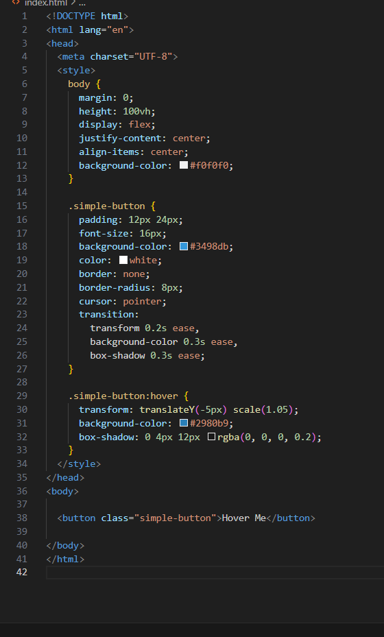

# HoverMe
through this I learned you can add interactive, dynamic feeling to a webpage without writing a single line of JS.
Learned how to center elements.
It was good to seeing a button come to life with just a few lines of CSS..
I'd add a smooth color fade on hover..like changing the background..

[Watch demo](demo.mp4)